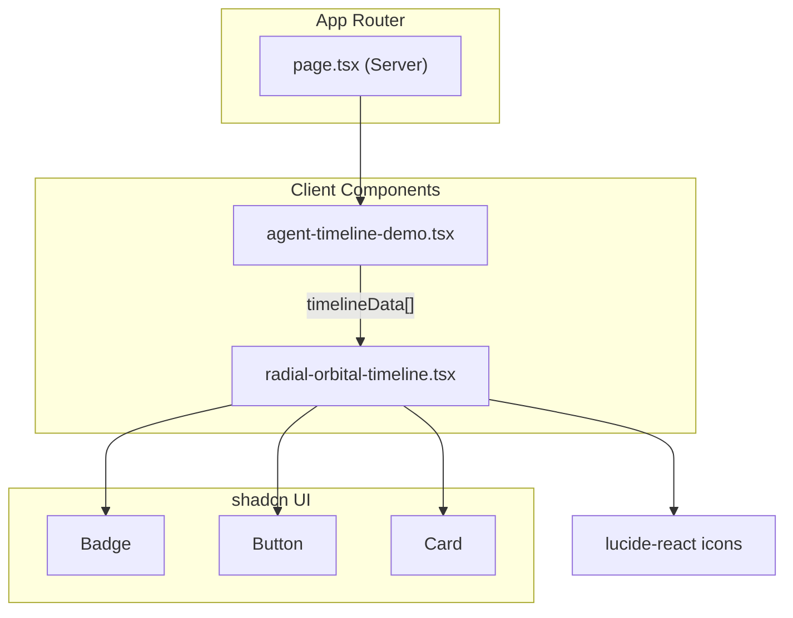

# Radial Orbital Timeline — Source Code & Documentation

This document contains the **full source code** for the NV AI Agent Nodes radial orbital timeline feature, along with a detailed explanation of how each part works.

---

## Table of Contents

1. [Overview](#overview)
2. [Architecture](#architecture)
3. [Project Structure](#project-structure)
4. [How It Works](#how-it-works)
5. [Hydration Fix](#hydration-fix)
6. [Customization Guide](#customization-guide)
7. [Source Code](#source-code)
   - [radial-orbital-timeline.tsx](#radial-orbital-timelinetsx)
   - [agent-timeline-demo.tsx](#agent-timeline-demotsx)
   - [page.tsx](#pagetsx)
   - [utils.ts](#utilstsx)
   - [badge.tsx](#badgetsx)
   - [button.tsx](#buttontsx)
   - [card.tsx](#cardtsx)

---

## Overview

The **Radial Orbital Timeline** is an interactive React visualization that places timeline or workflow nodes on a circle around a central “hub.” Nodes auto-rotate slowly; clicking a node expands a detail card, highlights related nodes, and pauses rotation while centering that node toward the front.

This project uses:

- **Next.js 16** (App Router)
- **React 19** client components
- **Tailwind CSS v4** for styling
- **shadcn/ui** for `Badge`, `Button`, and `Card`
- **lucide-react** for icons

---

## Architecture



**Data flow:** `page.tsx` renders `AgentTimelineDemo`, which defines an array of `TimelineItem` objects and passes it to `RadialOrbitalTimeline`. The timeline component owns all interaction state (rotation, expansion, pulses).

---

## Project Structure

| File | Role |
|------|------|
| `src/app/page.tsx` | Home route; mounts the demo |
| `src/components/agent-timeline-demo.tsx` | Sample AI agent node data |
| `src/components/radial-orbital-timeline.tsx` | Core orbital UI and logic |
| `src/components/ui/badge.tsx` | Status labels in expanded cards |
| `src/components/ui/button.tsx` | “Connected Nodes” navigation buttons |
| `src/components/ui/card.tsx` | Expanded node detail panel |
| `src/lib/utils.ts` | `cn()` helper for Tailwind class merging |

---

## How It Works

### 1. Orbital positioning (`calculateNodePosition`)

Each node is placed on a circle using polar coordinates:

- **Base angle:** `(index / totalNodes) * 360` — evenly spaces nodes around the ring.
- **Rotation offset:** `rotationAngle` — global spin updated every 50ms when `autoRotate` is true.
- **Radius:** `200` pixels from the center.
- **Position:** `x = radius * cos(θ)`, `y = radius * sin(θ)`.
- **Depth cue:** `zIndex` and `opacity` vary with `cos/sin` so nodes nearer the “front” appear brighter and on top.

Values are rounded with `roundStyle()` to keep animation stable.

### 2. Auto-rotation

A `setInterval` increments `rotationAngle` by `0.3°` every 50ms (~6°/second). The timer only runs when:

- `isMounted` is true (client-only; see hydration fix),
- `autoRotate` is true,
- `viewMode` is `"orbital"`.

### 3. Node interaction (`toggleItem`)

Clicking a node:

1. Collapses every other expanded node (only one open at a time).
2. Toggles the clicked node’s expanded state.
3. On **open:** sets `activeNodeId`, stops auto-rotate, pulses `relatedIds`, and calls `centerViewOnNode`.
4. On **close:** clears active state and resumes auto-rotate.

`centerViewOnNode` sets `rotationAngle` to `270 - targetAngle` so the selected node moves toward the bottom-front of the orbit (270° in standard math coordinates).

### 4. Background click reset

Clicking the outer container or orbit ring (not a node) clears expansion, active node, pulse effects, and re-enables auto-rotate.

### 5. Expanded card UI

When expanded, each node shows a `Card` with:

- Status `Badge` (COMPLETE / IN PROGRESS / PENDING)
- Date, title, description
- Energy bar (width = `energy` %)
- Connected node buttons that call `toggleItem(relatedId)`

### 6. Visual layers

From back to front:

1. Black full-screen background
2. Orbit ring (`w-96 h-96` border circle)
3. Central gradient orb with ping animations
4. Nodes (absolute positioned, dynamic `transform`)
5. Expanded card (`zIndex: 200`)

### 7. Energy glow

Each node has a radial gradient halo whose size scales with `item.energy` (`energy * 0.5 + 40` pixels).

---

## Hydration Fix

Next.js pre-renders client components on the server. Trigonometry (`Math.cos` / `Math.sin`) can produce **slightly different floating-point results** in Node vs the browser, causing React hydration warnings on `transform`, `opacity`, and `zIndex`.

**Solution in this codebase:**

1. `isMounted` starts `false`; `useEffect` sets it `true` after mount.
2. Orbital **nodes render only when `isMounted`** — server HTML and the first client pass match (no nodes).
3. `roundStyle()` rounds `x`, `y`, and `opacity` to 3 decimal places for consistent updates after mount.

---

## Customization Guide

### Add or edit nodes

Edit `agentTimelineData` in `agent-timeline-demo.tsx` (or pass your own array):

```ts
{
  id: 7,
  title: "Validator",
  date: "2026-06-04",
  content: "Validates tool outputs before synthesis.",
  category: "quality",
  icon: ShieldCheck, // from lucide-react
  relatedIds: [2, 6],
  status: "pending",
  energy: 55,
}
```

### Change orbit speed

In `radial-orbital-timeline.tsx`, adjust the interval step:

```ts
const newAngle = (prev + 0.3) % 360; // increase 0.3 for faster spin
```

Or change interval ms (`50` → `30`).

### Change orbit radius

Update `const radius = 200` in `calculateNodePosition` and optionally the ring size (`w-96` = 384px).

### Use the timeline elsewhere

```tsx
import RadialOrbitalTimeline, { type TimelineItem } from "@/components/radial-orbital-timeline";

<RadialOrbitalTimeline timelineData={myData} />
```

---

## Source Code

### radial-orbital-timeline.tsx

**Path:** `src/components/radial-orbital-timeline.tsx`

Main interactive component. Marked `"use client"` because it uses hooks, intervals, and browser-only rendering for nodes.

```tsx
"use client";

import { useState, useEffect, useRef } from "react";
import { ArrowRight, Link, Zap } from "lucide-react";
import { Badge } from "@/components/ui/badge";
import { Button } from "@/components/ui/button";
import { Card, CardContent, CardHeader, CardTitle } from "@/components/ui/card";

export interface TimelineItem {
  id: number;
  title: string;
  date: string;
  content: string;
  category: string;
  icon: React.ElementType;
  relatedIds: number[];
  status: "completed" | "in-progress" | "pending";
  energy: number;
}

interface RadialOrbitalTimelineProps {
  timelineData: TimelineItem[];
}

export default function RadialOrbitalTimeline({
  timelineData,
}: RadialOrbitalTimelineProps) {
  const [expandedItems, setExpandedItems] = useState<Record<number, boolean>>(
    {}
  );
  const [viewMode] = useState<"orbital">("orbital");
  const [rotationAngle, setRotationAngle] = useState<number>(0);
  const [autoRotate, setAutoRotate] = useState<boolean>(true);
  const [pulseEffect, setPulseEffect] = useState<Record<number, boolean>>({});
  const [centerOffset] = useState<{ x: number; y: number }>({
    x: 0,
    y: 0,
  });
  const [activeNodeId, setActiveNodeId] = useState<number | null>(null);
  const [isMounted, setIsMounted] = useState(false);
  const containerRef = useRef<HTMLDivElement>(null);
  const orbitRef = useRef<HTMLDivElement>(null);
  const nodeRefs = useRef<Record<number, HTMLDivElement | null>>({});

  const handleContainerClick = (e: React.MouseEvent<HTMLDivElement>) => {
    if (e.target === containerRef.current || e.target === orbitRef.current) {
      setExpandedItems({});
      setActiveNodeId(null);
      setPulseEffect({});
      setAutoRotate(true);
    }
  };

  const toggleItem = (id: number) => {
    setExpandedItems((prev) => {
      const newState = { ...prev };
      Object.keys(newState).forEach((key) => {
        if (parseInt(key) !== id) {
          newState[parseInt(key)] = false;
        }
      });

      newState[id] = !prev[id];

      if (!prev[id]) {
        setActiveNodeId(id);
        setAutoRotate(false);

        const relatedItems = getRelatedItems(id);
        const newPulseEffect: Record<number, boolean> = {};
        relatedItems.forEach((relId) => {
          newPulseEffect[relId] = true;
        });
        setPulseEffect(newPulseEffect);

        centerViewOnNode(id);
      } else {
        setActiveNodeId(null);
        setAutoRotate(true);
        setPulseEffect({});
      }

      return newState;
    });
  };

  useEffect(() => {
    setIsMounted(true);
  }, []);

  useEffect(() => {
    if (!isMounted || !autoRotate || viewMode !== "orbital") {
      return;
    }

    const rotationTimer = setInterval(() => {
      setRotationAngle((prev) => {
        const newAngle = (prev + 0.3) % 360;
        return Number(newAngle.toFixed(3));
      });
    }, 50);

    return () => clearInterval(rotationTimer);
  }, [autoRotate, viewMode, isMounted]);

  const centerViewOnNode = (nodeId: number) => {
    if (viewMode !== "orbital" || !nodeRefs.current[nodeId]) return;

    const nodeIndex = timelineData.findIndex((item) => item.id === nodeId);
    const totalNodes = timelineData.length;
    const targetAngle = (nodeIndex / totalNodes) * 360;

    setRotationAngle(270 - targetAngle);
  };

  const roundStyle = (value: number, decimals = 3) =>
    Number(value.toFixed(decimals));

  const calculateNodePosition = (index: number, total: number) => {
    const angle = ((index / total) * 360 + rotationAngle) % 360;
    const radius = 200;
    const radian = (angle * Math.PI) / 180;

    const x = roundStyle(radius * Math.cos(radian) + centerOffset.x);
    const y = roundStyle(radius * Math.sin(radian) + centerOffset.y);

    const zIndex = Math.round(100 + 50 * Math.cos(radian));
    const opacity = roundStyle(
      Math.max(0.4, Math.min(1, 0.4 + 0.6 * ((1 + Math.sin(radian)) / 2)))
    );

    return { x, y, angle, zIndex, opacity };
  };

  const getRelatedItems = (itemId: number): number[] => {
    const currentItem = timelineData.find((item) => item.id === itemId);
    return currentItem ? currentItem.relatedIds : [];
  };

  const isRelatedToActive = (itemId: number): boolean => {
    if (!activeNodeId) return false;
    const relatedItems = getRelatedItems(activeNodeId);
    return relatedItems.includes(itemId);
  };

  const getStatusStyles = (status: TimelineItem["status"]): string => {
    switch (status) {
      case "completed":
        return "text-white bg-black border-white";
      case "in-progress":
        return "text-black bg-white border-black";
      case "pending":
        return "text-white bg-black/40 border-white/50";
      default:
        return "text-white bg-black/40 border-white/50";
    }
  };

  return (
    <div
      className="w-full h-screen flex flex-col items-center justify-center bg-black overflow-hidden"
      ref={containerRef}
      onClick={handleContainerClick}
    >
      <div className="relative w-full max-w-4xl h-full flex items-center justify-center">
        <div
          className="absolute w-full h-full flex items-center justify-center"
          ref={orbitRef}
          style={{
            perspective: "1000px",
            transform: `translate(${centerOffset.x}px, ${centerOffset.y}px)`,
          }}
        >
          <div className="absolute w-16 h-16 rounded-full bg-gradient-to-br from-purple-500 via-blue-500 to-teal-500 animate-pulse flex items-center justify-center z-10">
            <div className="absolute w-20 h-20 rounded-full border border-white/20 animate-ping opacity-70"></div>
            <div
              className="absolute w-24 h-24 rounded-full border border-white/10 animate-ping opacity-50"
              style={{ animationDelay: "0.5s" }}
            ></div>
            <div className="w-8 h-8 rounded-full bg-white/80 backdrop-blur-md"></div>
          </div>

          <div className="absolute w-96 h-96 rounded-full border border-white/10"></div>

          {isMounted &&
            timelineData.map((item, index) => {
            const position = calculateNodePosition(index, timelineData.length);
            const isExpanded = expandedItems[item.id];
            const isRelated = isRelatedToActive(item.id);
            const isPulsing = pulseEffect[item.id];
            const Icon = item.icon;

            const nodeStyle = {
              transform: `translate(${position.x}px, ${position.y}px)`,
              zIndex: isExpanded ? 200 : position.zIndex,
              opacity: isExpanded ? 1 : position.opacity,
            };

            return (
              <div
                key={item.id}
                ref={(el) => {
                  nodeRefs.current[item.id] = el;
                }}
                className="absolute transition-all duration-700 cursor-pointer"
                style={nodeStyle}
                onClick={(e) => {
                  e.stopPropagation();
                  toggleItem(item.id);
                }}
              >
                <div
                  className={`absolute rounded-full -inset-1 ${
                    isPulsing ? "animate-pulse duration-1000" : ""
                  }`}
                  style={{
                    background: `radial-gradient(circle, rgba(255,255,255,0.2) 0%, rgba(255,255,255,0) 70%)`,
                    width: `${item.energy * 0.5 + 40}px`,
                    height: `${item.energy * 0.5 + 40}px`,
                    left: `-${(item.energy * 0.5 + 40 - 40) / 2}px`,
                    top: `-${(item.energy * 0.5 + 40 - 40) / 2}px`,
                  }}
                ></div>

                <div
                  className={`
                  w-10 h-10 rounded-full flex items-center justify-center
                  ${
                    isExpanded
                      ? "bg-white text-black"
                      : isRelated
                        ? "bg-white/50 text-black"
                        : "bg-black text-white"
                  }
                  border-2 
                  ${
                    isExpanded
                      ? "border-white shadow-lg shadow-white/30"
                      : isRelated
                        ? "border-white animate-pulse"
                        : "border-white/40"
                  }
                  transition-all duration-300 transform
                  ${isExpanded ? "scale-150" : ""}
                `}
                >
                  <Icon size={16} />
                </div>

                <div
                  className={`
                  absolute top-12  whitespace-nowrap
                  text-xs font-semibold tracking-wider
                  transition-all duration-300
                  ${isExpanded ? "text-white scale-125" : "text-white/70"}
                `}
                >
                  {item.title}
                </div>

                {isExpanded && (
                  <Card className="absolute top-20 left-1/2 -translate-x-1/2 w-64 bg-black/90 backdrop-blur-lg border-white/30 shadow-xl shadow-white/10 overflow-visible">
                    <div className="absolute -top-3 left-1/2 -translate-x-1/2 w-px h-3 bg-white/50"></div>
                    <CardHeader className="pb-2">
                      <div className="flex justify-between items-center">
                        <Badge
                          className={`px-2 text-xs ${getStatusStyles(
                            item.status
                          )}`}
                        >
                          {item.status === "completed"
                            ? "COMPLETE"
                            : item.status === "in-progress"
                              ? "IN PROGRESS"
                              : "PENDING"}
                        </Badge>
                        <span className="text-xs font-mono text-white/50">
                          {item.date}
                        </span>
                      </div>
                      <CardTitle className="text-sm mt-2">
                        {item.title}
                      </CardTitle>
                    </CardHeader>
                    <CardContent className="text-xs text-white/80">
                      <p>{item.content}</p>

                      <div className="mt-4 pt-3 border-t border-white/10">
                        <div className="flex justify-between items-center text-xs mb-1">
                          <span className="flex items-center">
                            <Zap size={10} className="mr-1" />
                            Energy Level
                          </span>
                          <span className="font-mono">{item.energy}%</span>
                        </div>
                        <div className="w-full h-1 bg-white/10 rounded-full overflow-hidden">
                          <div
                            className="h-full bg-gradient-to-r from-blue-500 to-purple-500"
                            style={{ width: `${item.energy}%` }}
                          ></div>
                        </div>
                      </div>

                      {item.relatedIds.length > 0 && (
                        <div className="mt-4 pt-3 border-t border-white/10">
                          <div className="flex items-center mb-2">
                            <Link size={10} className="text-white/70 mr-1" />
                            <h4 className="text-xs uppercase tracking-wider font-medium text-white/70">
                              Connected Nodes
                            </h4>
                          </div>
                          <div className="flex flex-wrap gap-1">
                            {item.relatedIds.map((relatedId) => {
                              const relatedItem = timelineData.find(
                                (i) => i.id === relatedId
                              );
                              return (
                                <Button
                                  key={relatedId}
                                  variant="outline"
                                  size="sm"
                                  className="flex items-center h-6 px-2 py-0 text-xs rounded-none border-white/20 bg-transparent hover:bg-white/10 text-white/80 hover:text-white transition-all"
                                  onClick={(e) => {
                                    e.stopPropagation();
                                    toggleItem(relatedId);
                                  }}
                                >
                                  {relatedItem?.title}
                                  <ArrowRight
                                    size={8}
                                    className="ml-1 text-white/60"
                                  />
                                </Button>
                              );
                            })}
                          </div>
                        </div>
                      )}
                    </CardContent>
                  </Card>
                )}
              </div>
            );
            })}
        </div>
      </div>
    </div>
  );
}
```

#### State reference

| State | Type | Purpose |
|-------|------|---------|
| `expandedItems` | `Record<number, boolean>` | Which node cards are open |
| `rotationAngle` | `number` | Global orbit rotation (degrees) |
| `autoRotate` | `boolean` | Whether the orbit spins automatically |
| `pulseEffect` | `Record<number, boolean>` | Highlight halos on related nodes |
| `activeNodeId` | `number \| null` | Currently focused node |
| `isMounted` | `boolean` | Client mount gate for hydration safety |
| `centerOffset` | `{ x, y }` | Reserved for panning the orbit (currently 0,0) |

#### Key functions

| Function | Purpose |
|----------|---------|
| `handleContainerClick` | Reset UI when clicking empty space |
| `toggleItem` | Open/close node; manage rotate, pulse, centering |
| `centerViewOnNode` | Snap rotation so selected node faces forward |
| `calculateNodePosition` | Polar → Cartesian layout per frame |
| `getRelatedItems` | Lookup `relatedIds` for a node |
| `isRelatedToActive` | Style related nodes when another is active |
| `getStatusStyles` | Tailwind classes for status badges |

---

### agent-timeline-demo.tsx

**Path:** `src/components/agent-timeline-demo.tsx`

Wraps the timeline with **sample AI agent pipeline data**: Input → Planner → Retriever → Tools → Memory → Output. `relatedIds` define the graph edges shown when a node is selected.

```tsx
"use client";

import {
  Brain,
  Database,
  MessageSquare,
  Search,
  Sparkles,
  Wrench,
} from "lucide-react";
import RadialOrbitalTimeline, {
  type TimelineItem,
} from "@/components/radial-orbital-timeline";

const agentTimelineData: TimelineItem[] = [
  {
    id: 1,
    title: "Input",
    date: "2026-06-01",
    content:
      "Receives user prompts and normalizes context for downstream agent nodes.",
    category: "ingress",
    icon: MessageSquare,
    relatedIds: [2, 3],
    status: "completed",
    energy: 92,
  },
  {
    id: 2,
    title: "Planner",
    date: "2026-06-02",
    content:
      "Breaks goals into steps, selects tools, and routes work to specialized nodes.",
    category: "orchestration",
    icon: Brain,
    relatedIds: [1, 3, 4],
    status: "completed",
    energy: 88,
  },
  {
    id: 3,
    title: "Retriever",
    date: "2026-06-02",
    content:
      "Fetches relevant documents and embeddings from the knowledge store.",
    category: "rag",
    icon: Search,
    relatedIds: [2, 5],
    status: "in-progress",
    energy: 74,
  },
  {
    id: 4,
    title: "Tools",
    date: "2026-06-03",
    content:
      "Executes MCP and API tools; returns structured results to the planner.",
    category: "execution",
    icon: Wrench,
    relatedIds: [2, 6],
    status: "in-progress",
    energy: 65,
  },
  {
    id: 5,
    title: "Memory",
    date: "2026-06-03",
    content:
      "Persists session state, long-term facts, and vector indexes for recall.",
    category: "storage",
    icon: Database,
    relatedIds: [3, 6],
    status: "pending",
    energy: 45,
  },
  {
    id: 6,
    title: "Output",
    date: "2026-06-03",
    content:
      "Synthesizes final responses with citations and streams tokens to the client.",
    category: "egress",
    icon: Sparkles,
    relatedIds: [4, 5],
    status: "pending",
    energy: 38,
  },
];

export default function AgentTimelineDemo() {
  return <RadialOrbitalTimeline timelineData={agentTimelineData} />;
}
```

#### `TimelineItem` field guide

| Field | Description |
|-------|-------------|
| `id` | Unique numeric identifier |
| `title` | Short label under the node icon |
| `date` | Shown in the expanded card header |
| `content` | Longer description in the card body |
| `category` | Logical grouping (not rendered by default; useful for filtering) |
| `icon` | Lucide React component for the node circle |
| `relatedIds` | IDs of linked nodes; used for pulse + navigation |
| `status` | `completed` \| `in-progress` \| `pending` — controls badge styling |
| `energy` | 0–100; drives glow size and progress bar width |

---

### page.tsx

**Path:** `src/app/page.tsx`

Server Component entry point. Keeps the home route minimal: no client hooks here.

```tsx
import AgentTimelineDemo from "@/components/agent-timeline-demo";

export default function Home() {
  return <AgentTimelineDemo />;
}
```

---

### utils.ts

**Path:** `src/lib/utils.ts`

Shared Tailwind class merger used by shadcn components.

```ts
import { clsx, type ClassValue } from "clsx"
import { twMerge } from "tailwind-merge"

export function cn(...inputs: ClassValue[]) {
  return twMerge(clsx(inputs))
}
```

**Explanation:** `clsx` builds conditional class strings; `twMerge` resolves conflicting Tailwind utilities (e.g. two `padding` classes) so the last intentional class wins.

---

### badge.tsx

**Path:** `src/components/ui/badge.tsx`

shadcn **Badge** used for status labels in expanded cards. Supports variants via `class-variance-authority` (CVA).

```tsx
import { mergeProps } from "@base-ui/react/merge-props"
import { useRender } from "@base-ui/react/use-render"
import { cva, type VariantProps } from "class-variance-authority"

import { cn } from "@/lib/utils"

const badgeVariants = cva(
  "group/badge inline-flex h-5 w-fit shrink-0 items-center justify-center gap-1 overflow-hidden rounded-4xl border border-transparent px-2 py-0.5 text-xs font-medium whitespace-nowrap transition-all focus-visible:border-ring focus-visible:ring-[3px] focus-visible:ring-ring/50 has-data-[icon=inline-end]:pr-1.5 has-data-[icon=inline-start]:pl-1.5 aria-invalid:border-destructive aria-invalid:ring-destructive/20 dark:aria-invalid:ring-destructive/40 [&>svg]:pointer-events-none [&>svg]:size-3!",
  {
    variants: {
      variant: {
        default: "bg-primary text-primary-foreground [a]:hover:bg-primary/80",
        secondary:
          "bg-secondary text-secondary-foreground [a]:hover:bg-secondary/80",
        destructive:
          "bg-destructive/10 text-destructive focus-visible:ring-destructive/20 dark:bg-destructive/20 dark:focus-visible:ring-destructive/40 [a]:hover:bg-destructive/20",
        outline:
          "border-border text-foreground [a]:hover:bg-muted [a]:hover:text-muted-foreground",
        ghost:
          "hover:bg-muted hover:text-muted-foreground dark:hover:bg-muted/50",
        link: "text-primary underline-offset-4 hover:underline",
      },
    },
    defaultVariants: {
      variant: "default",
    },
  }
)

function Badge({
  className,
  variant = "default",
  render,
  ...props
}: useRender.ComponentProps<"span"> & VariantProps<typeof badgeVariants>) {
  return useRender({
    defaultTagName: "span",
    props: mergeProps<"span">(
      {
        className: cn(badgeVariants({ variant }), className),
      },
      props
    ),
    render,
    state: {
      slot: "badge",
      variant,
    },
  })
}

export { Badge, badgeVariants }
```

In the timeline, custom `className` from `getStatusStyles()` overrides default colors for COMPLETE / IN PROGRESS / PENDING.

---

### button.tsx

**Path:** `src/components/ui/button.tsx`

shadcn **Button** for “Connected Nodes” links. The timeline uses `variant="outline"` and `size="sm"`.

```tsx
import { Button as ButtonPrimitive } from "@base-ui/react/button"
import { cva, type VariantProps } from "class-variance-authority"

import { cn } from "@/lib/utils"

const buttonVariants = cva(
  "group/button inline-flex shrink-0 items-center justify-center rounded-lg border border-transparent bg-clip-padding text-sm font-medium whitespace-nowrap transition-all outline-none select-none focus-visible:border-ring focus-visible:ring-3 focus-visible:ring-ring/50 active:not-aria-[haspopup]:translate-y-px disabled:pointer-events-none disabled:opacity-50 aria-invalid:border-destructive aria-invalid:ring-3 aria-invalid:ring-destructive/20 dark:aria-invalid:border-destructive/50 dark:aria-invalid:ring-destructive/40 [&_svg]:pointer-events-none [&_svg]:shrink-0 [&_svg:not([class*='size-'])]:size-4",
  {
    variants: {
      variant: {
        default: "bg-primary text-primary-foreground hover:bg-primary/80",
        outline:
          "border-border bg-background hover:bg-muted hover:text-foreground aria-expanded:bg-muted aria-expanded:text-foreground dark:border-input dark:bg-input/30 dark:hover:bg-input/50",
        secondary:
          "bg-secondary text-secondary-foreground hover:bg-[color-mix(in_oklch,var(--secondary),var(--foreground)_5%)] aria-expanded:bg-secondary aria-expanded:text-secondary-foreground",
        ghost:
          "hover:bg-muted hover:text-foreground aria-expanded:bg-muted aria-expanded:text-foreground dark:hover:bg-muted/50",
        destructive:
          "bg-destructive/10 text-destructive hover:bg-destructive/20 focus-visible:border-destructive/40 focus-visible:ring-destructive/20 dark:bg-destructive/20 dark:hover:bg-destructive/30 dark:focus-visible:ring-destructive/40",
        link: "text-primary underline-offset-4 hover:underline",
      },
      size: {
        default:
          "h-8 gap-1.5 px-2.5 has-data-[icon=inline-end]:pr-2 has-data-[icon=inline-start]:pl-2",
        xs: "h-6 gap-1 rounded-[min(var(--radius-md),10px)] px-2 text-xs in-data-[slot=button-group]:rounded-lg has-data-[icon=inline-end]:pr-1.5 has-data-[icon=inline-start]:pl-1.5 [&_svg:not([class*='size-'])]:size-3",
        sm: "h-7 gap-1 rounded-[min(var(--radius-md),12px)] px-2.5 text-[0.8rem] in-data-[slot=button-group]:rounded-lg has-data-[icon=inline-end]:pr-1.5 has-data-[icon=inline-start]:pl-1.5 [&_svg:not([class*='size-'])]:size-3.5",
        lg: "h-9 gap-1.5 px-2.5 has-data-[icon=inline-end]:pr-2 has-data-[icon=inline-start]:pl-2",
        icon: "size-8",
        "icon-xs":
          "size-6 rounded-[min(var(--radius-md),10px)] in-data-[slot=button-group]:rounded-lg [&_svg:not([class*='size-'])]:size-3",
        "icon-sm":
          "size-7 rounded-[min(var(--radius-md),12px)] in-data-[slot=button-group]:rounded-lg",
        "icon-lg": "size-9",
      },
    },
    defaultVariants: {
      variant: "default",
      size: "default",
    },
  }
)

function Button({
  className,
  variant = "default",
  size = "default",
  ...props
}: ButtonPrimitive.Props & VariantProps<typeof buttonVariants>) {
  return (
    <ButtonPrimitive
      data-slot="button"
      className={cn(buttonVariants({ variant, size, className }))}
      {...props}
    />
  )
}

export { Button, buttonVariants }
```

`e.stopPropagation()` on button clicks prevents the parent node from toggling closed when navigating to a related node.

---

### card.tsx

**Path:** `src/components/ui/card.tsx`

shadcn **Card** compound component for the expanded detail panel.

```tsx
import * as React from "react"

import { cn } from "@/lib/utils"

function Card({
  className,
  size = "default",
  ...props
}: React.ComponentProps<"div"> & { size?: "default" | "sm" }) {
  return (
    <div
      data-slot="card"
      data-size={size}
      className={cn(
        "group/card flex flex-col gap-4 overflow-hidden rounded-xl bg-card py-4 text-sm text-card-foreground ring-1 ring-foreground/10 has-data-[slot=card-footer]:pb-0 has-[>img:first-child]:pt-0 data-[size=sm]:gap-3 data-[size=sm]:py-3 data-[size=sm]:has-data-[slot=card-footer]:pb-0 *:[img:first-child]:rounded-t-xl *:[img:last-child]:rounded-b-xl",
        className
      )}
      {...props}
    />
  )
}

function CardHeader({ className, ...props }: React.ComponentProps<"div">) {
  return (
    <div
      data-slot="card-header"
      className={cn(
        "group/card-header @container/card-header grid auto-rows-min items-start gap-1 rounded-t-xl px-4 group-data-[size=sm]/card:px-3 has-data-[slot=card-action]:grid-cols-[1fr_auto] has-data-[slot=card-description]:grid-rows-[auto_auto] [.border-b]:pb-4 group-data-[size=sm]/card:[.border-b]:pb-3",
        className
      )}
      {...props}
    />
  )
}

function CardTitle({ className, ...props }: React.ComponentProps<"div">) {
  return (
    <div
      data-slot="card-title"
      className={cn(
        "font-heading text-base leading-snug font-medium group-data-[size=sm]/card:text-sm",
        className
      )}
      {...props}
    />
  )
}

function CardDescription({ className, ...props }: React.ComponentProps<"div">) {
  return (
    <div
      data-slot="card-description"
      className={cn("text-sm text-muted-foreground", className)}
      {...props}
    />
  )
}

function CardAction({ className, ...props }: React.ComponentProps<"div">) {
  return (
    <div
      data-slot="card-action"
      className={cn(
        "col-start-2 row-span-2 row-start-1 self-start justify-self-end",
        className
      )}
      {...props}
    />
  )
}

function CardContent({ className, ...props }: React.ComponentProps<"div">) {
  return (
    <div
      data-slot="card-content"
      className={cn("px-4 group-data-[size=sm]/card:px-3", className)}
      {...props}
    />
  )
}

function CardFooter({ className, ...props }: React.ComponentProps<"div">) {
  return (
    <div
      data-slot="card-footer"
      className={cn(
        "flex items-center rounded-b-xl border-t bg-muted/50 p-4 group-data-[size=sm]/card:p-3",
        className
      )}
      {...props}
    />
  )
}

export {
  Card,
  CardHeader,
  CardFooter,
  CardTitle,
  CardAction,
  CardDescription,
  CardContent,
}
```

The timeline applies dark-theme overrides on `Card` (`bg-black/90`, `border-white/30`, etc.) so it reads well on the black orbital background.

---

## Running the project

```bash
npm install
npm run dev
```

Open [http://localhost:3000](http://localhost:3000).

---

## Dependencies (relevant)

| Package | Use |
|---------|-----|
| `next`, `react`, `react-dom` | Framework |
| `lucide-react` | Node and UI icons |
| `tailwindcss` | Layout and animation classes |
| `class-variance-authority` | shadcn variant styling |
| `@base-ui/react` | shadcn button/badge primitives |
| `clsx`, `tailwind-merge` | `cn()` utility |

---

*Generated for the `nv_ai_agent_nodes` project.*
